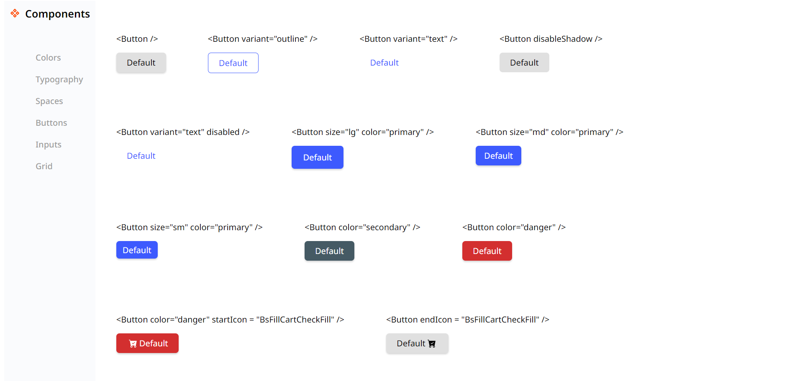

<!-- Please update value in the {}  -->

<h1 align="center">Button Component</h1>

   Solution for a challenge from  <a href="http://devchallenges.io" target="_blank">Devchallenges.io</a>.

  <h3>
    <a href="https://iridescent-blini-966516.netlify.app/" target="_blank">
      Demo
    </a>
     | 
    <a href="https://devchallenges.io/solutions/nXtDuDqIUy3grFzlIYOO" target="_blank">
      Button component Solution
    </a>
     | 
    <a href="https://devchallenges.io/challenges/ohgVTyJCbm5OZyTB2gNY" target="_blank">
      Challenge
    </a>
  </h3>

<!-- TABLE OF CONTENTS -->

## Table of Contents

- [Table of Contents](#table-of-contents)
- [Overview](#overview)
  - [Built With](#built-with)
- [Features](#features)
- [Contact](#contact)

<!-- OVERVIEW -->

## Overview

### Built With

<!-- This section should list any major frameworks that you built your project using. Here are a few examples.-->

- HTML
- SASS
- React Js

## Features

<!-- List the features of your application or follow the template. Don't share the figma file here :) -->

This application/site was created as a submission to a [DevChallenges](https://devchallenges.io/challenges) challenge.

- [Button component challenge](https://devchallenges.io/challenges/ohgVTyJCbm5OZyTB2gNY)

## Contact

- Website [prasannakarki77-website.com](https://compassionate-lichterman-26c523.netlify.app/)
- GitHub [@prasannakarki77](https://github.com/prasannakarki77)
- Twitter [@PrkKarkee-twitter](https://twitter.com/PrkKarkee)
